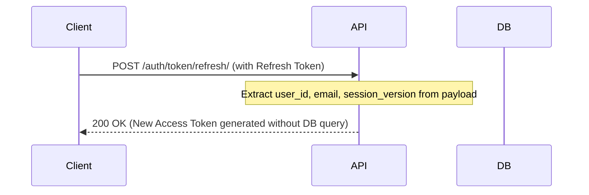
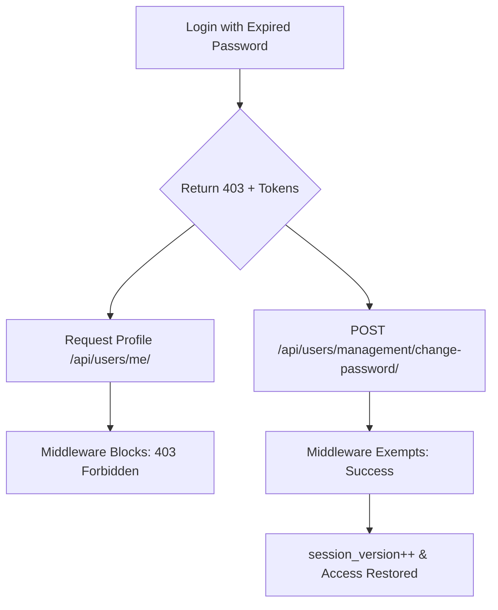

# Authentication Architecture

This document provides a technical deep-dive into the authentication system of the `users` application. It is designed to guide engineers through the security mechanics, performance optimizations, and session management logic.

## 1. JWT Strategy & Performance

The system uses **JSON Web Tokens (JWT)** for stateless authentication, built upon `djangorestframework-simplejwt`.

### Custom Token Payloads

To minimize database pressure and token size, we use specialized token classes in `users/tokens.py`:

- **`CustomAccessToken`**: Short-lived (10 min). Contains only `user_id`, `email`, and `session_version`.
- **`CustomRefreshToken`**: Long-lived (1 day). Caches the `email` and `session_version` internally.

### Performance Optimization: Zero DB Lookups

During token rotation (refreshing an access token), the system achieves **Zero DB Lookups**. The `CustomRefreshToken.access_token` property generates a new access token by reading claims directly from the refresh token's payload.

## 2. Session Versioning & Invalidation

Stateless JWTs are notoriously difficult to invalidate. We solve this using **Session Versioning** (`session_version` field on the `User` model).

1. **Generation**: Both access and refresh tokens include the user's current `session_version`.
2. **Validation**: The `CustomJWTAuthentication` class compares the token's version against the database's version on every request.
3. **Invalidation**: On sensitive events (Password change, Logout, Admin force-logout), the `session_version` is incremented. All existing tokens (even if unexpired) become immediately invalid.

## 3. Throttling Engine

We implement granular rate limiting in `users/throttling.py` to protect sensitive endpoints.

| Scope       | Rate     | Target  | Use Case                          |
| :---------- | :------- | :------ | :-------------------------------- |
| `anon`      | 500/hour | IP      | General anonymous traffic         |
| `user`      | 5000/day | User ID | General authenticated traffic     |
| `login`     | 5/min    | IP      | Brute-force protection on Login   |
| `register`  | 2/hour   | IP      | Spam protection for new accounts  |
| `sensitive` | 10/hour  | User/IP | Password changes, profile updates |
| `search`    | 30/min   | User/IP | Scraper protection for user list  |

> [!IMPORTANT]
> **Superuser Exemption**: All custom throttles inherit from `UserThrottle`, which unconditionally allows requests from authenticated superusers to ensure management reliability.

## 4. Password Expiration & Renewal Flow

The `PasswordExpirationMiddleware` enforces a strict credential life-cycle (default 90 days).

### The 403 "Blocked" State

If a user authenticates with an expired password, the `LoginView` returns a `403 Forbidden` with:

- `error: "password_expired"`
- A standard JWT (access + refresh).

### Renewal Protocol

Users in the "expired" state are blocked by middleware from all endpoints _except_ the renewal API.

### Security Headers

Every authenticated response includes:

- `X-Password-Expires-In-Days`: Count of days until next required change.
- `X-Password-Expiry-Warning`: `true` if within the warning threshold (7 days).
