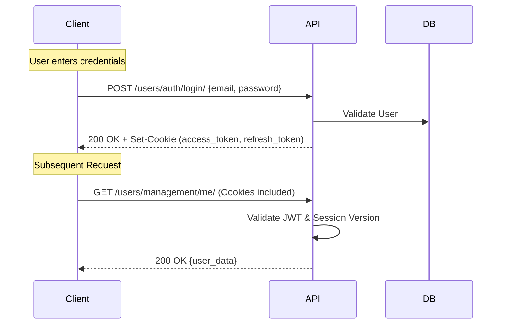

# Authentication API Guide (Frontend & AI)

This document outlines the authentication protocol for the Marketplace platform. It is intended for frontend developers and AI agents to ensure consistent implementation of authentication flows.

## 1. Authentication Strategy: HttpOnly Cookies

The backend uses **JWT (JSON Web Tokens)** stored in **HttpOnly, Secure, SameSite=Lax** cookies. This strategy protects against XSS (Cross-Site Scripting) by making tokens inaccessible to client-side JavaScript.

### Cookie Details

| Cookie Name            | Type    | Accessibility | Purpose                                                                     |
| :--------------------- | :------ | :------------ | :-------------------------------------------------------------------------- |
| `access_token`         | JWT     | HttpOnly      | Identity & Authorization for API requests.                                  |
| `refresh_token`        | JWT     | HttpOnly      | Scoped to `/api/users/auth/token/refresh/` for obtaining new access tokens. |
| `access_token_expires` | Unix TS | JavaScript    | **Frontend Utility**: Used by the client to know when to trigger a refresh. |

### Frontend Requirement: `credentials: 'include'`

All fetch requests from the frontend **must** include `credentials: 'include'` (or equivalent in your HTTP client) to ensure cookies are sent with the request and accepted from the response.

---

## 2. Authentication Flow



---

## 3. API Endpoints

### 3.1. User Registration

Creates a new account and automatically logs the user in.

- **URL**: `POST /users/management/`
- **Authentication**: None required.
- **Request Body**:
  ```json
  {
    "email": "user@example.com",
    "full_name": "John Doe",
    "password": "securepassword123",
    "telephone_number": "+1234567890" (optional)
  }
  ```
- **Response (201 Created)**:
  - **Body**: (Wrapped `EmbeddedUser` object)
    ```json
    {
    	"user": {
    		"user_id": "550e8400-e29b-41d4-a716-446655440000",
    		"email": "user@example.com",
    		"full_name": "John Doe"
    	}
    }
    ```
  - **Cookies**: Sets `access_token` and `refresh_token`.

### 3.2. Login

Authenticates user and returns tokens via cookies.

- **URL**: `POST /users/auth/login/`
- **Request Body**:
  ```json
  {
  	"email": "user@example.com",
  	"password": "password"
  }
  ```
- **Response (200 OK)**:
  - **Body**:
    ```json
    {
    	"user": {
    		"user_id": "550e8400-e29b-41d4-a716-446655440000",
    		"email": "user@example.com"
    	}
    }
    ```
  - **Cookies**: Sets `access_token` and `refresh_token`.

- **Response (403 Forbidden - Password Expired)**:
  - **Body**:
    ```json
    {
    	"error": "password_expired",
    	"detail": "Your password has expired. Please change it to continue.",
    	"user": {
    		"user_id": "550e8400-e29b-41d4-a716-446655440000",
    		"email": "user@example.com",
    		"full_name": "John Doe"
    	}
    }
    ```
  - **Cookies**: Sets `access_token` and `refresh_token` (limited access permitted only to password change).

### 3.3. Token Refresh

Retrieves a new access token using the `refresh_token` cookie.

- **URL**: `POST /users/auth/token/refresh/`
- **Request Body**: `{}`
- **Response (200 OK)**:
  - **Body**: `{ "detail": "Token successfully refreshed." }`
  - **Cookies**: Updates `access_token` and potentially `refresh_token` (if rotation is enabled).

### 3.4. Token Verify

Checks if the current `access_token` is still valid without making a data-intensive request.

- **URL**: `POST /users/auth/token/verify/`
- **Request Body**: `{}`
- **Response (200 OK)**: Empty body. Indicates token is valid.

### 3.5. Logout

Invalidates the session on the server and clears cookies.

- **URL**: `POST /users/auth/logout/`
- **Authentication**: Required (`access_token`).
- **Response (200 OK)**:
  - **Body**: `{ "detail": "Successfully logged out." }`
  - **Cookies**: Deletes `access_token`, `refresh_token`, and `access_token_expires`.

### 3.6. Change Password (Authenticated)

Updates password and generates new session tokens.

- **URL**: `POST /users/management/change-password/`
- **Authentication**: Required (Permitted even in "password_expired" state).
- **Request Body**:
  ```json
  {
  	"old_password": "current_password",
  	"new_password": "new_secure_password",
  	"confirm_password": "new_secure_password"
  }
  ```
- **Response (200 OK)**:
  - **Body**: `{ "detail": "Password has been changed successfully." }`
  - **Cookies**: Sets new `access_token` and `refresh_token` with incremented `session_version`.

### 3.7. Current User Profile

Retrieves the full profile of the logged-in user.

- **URL**: `GET /users/management/me/`
- **Authentication**: Required.
- **Response (200 OK)**:
  - **Body**:
    ```json
    {
    	"user": {
    		"user_id": "550e8400-e29b-41d4-a716-446655440000",
    		"email": "user@example.com",
    		"full_name": "John Doe",
    		"telephone_number": "+1234567890",
    		"password_changed_at": "2026-04-10T14:30:00Z",
    		"password_expired": false,
    		"created_at": "2026-04-10T14:30:00Z",
    		"updated_at": "2026-04-10T14:30:00Z"
    	}
    }
    ```

### 3.8. User Management (Staff/Admin Only)

Used by administrators to manage account lifecycles.

#### 3.8.1. Deactivate User

- **URL**: `POST /users/management/{pk}/deactivate/`
- **Response**:
  ```json
  {
  	"is_active": false,
  	"user": { "user_id": "...", "email": "...", "full_name": "..." }
  }
  ```

#### 3.8.2. Activate User

- **URL**: `POST /users/management/{pk}/activate/`
- **Response**:
  ```json
  {
  	"is_active": true,
  	"user": { "user_id": "...", "email": "...", "full_name": "..." }
  }
  ```

#### 3.8.3. Soft Delete User

- **URL**: `POST /users/management/{pk}/soft-delete/`
- **Response**:
  ```json
  {
  	"is_soft_deleted": true,
  	"soft_deleted_at": "2026-04-21T16:00:00Z",
  	"user": { "user_id": "...", "email": "...", "full_name": "..." }
  }
  ```

#### 3.8.4. Set Staff/Superuser Status

- **URL**: `POST /users/management/{pk}/set-staff-status/`
- **Body**: `{ "is_staff": true }`
- **Response**:
  ```json
  {
  	"is_staff": true,
  	"user": { "user_id": "...", "email": "...", "full_name": "..." }
  }
  ```

---

## 4. Key Rules & Constraints

### 4.1. Session Versioning

Every user has a `session_version` (integer). This version is a claim in both access and refresh tokens.

- Changing password or logging out increments this version.
- The backend compares the token's version with the user's version in the database on every request.
- **Tokens with a version mismatches are rejected immediately.**

### 4.2. Password Expiration Policy

- Passwords expire every 90 days.
- When expired, the user will receive a `403 Forbidden` with `code: "password_expired"`.
- **Middleware Lock**: While expired, all endpoints return 403 **except**:
  - `user-login`
  - `user-logout`
  - `user-token_refresh`
  - `user-change-password`

### 4.3. Rate Limiting (Throttling)

- **Login**: 5 attempts / min / IP.
- **Registration**: 2 attempts / hour / IP.
- **General Actions**: 5000 / day / User.
- **Password Changes**: 10 / hour / User.

---

## 5. Comprehensive Error Reference

### 5.1. Validation Errors (400 Bad Request)

Standard DRF field-based errors. This format applies to Login, Registration, and Profile updates.

**Registration Errors Example**:

```json
{
	"email": ["User with this email already exists."],
	"password": ["This password is too short.", "This password is too common."],
	"full_name": ["This field is required."]
}
```

**Login Errors Example**:

```json
{
	"email": ["This field is required."],
	"password": ["This field is required."]
}
```

**Non-Field Errors** (e.g., incorrect credentials):
Some authentication failures return a `non_field_errors` key or a `detail` key.

```json
{
	"non_field_errors": ["No active account found with the given credentials"]
}
```

OR

```json
{
	"detail": "No active account found with the given credentials"
}
```

### 5.2. Authentication Errors (401 Unauthorized)

Returned when tokens are missing, invalid, or expired.

```json
{
	"detail": "Given token not valid for any token type",
	"code": "token_not_valid",
	"messages": [
		{
			"token_class": "AccessToken",
			"token_type": "access",
			"message": "Token is invalid or expired"
		}
	]
}
```

### 5.3. Permission/Policy Errors (403 Forbidden)

Example: Password Expiration from Middleware.

```json
{
	"detail": "Your password has expired. Please change your password.",
	"code": "password_expired",
	"change_password_url": "/users/management/change-password/"
}
```

### 5.4. Rate Limit Errors (429 Too Many Requests)

```json
{
	"detail": "Request was throttled. Expected available in 54 seconds."
}
```

---

## 6. Data Models

### 6.1. UserProfile

This object is returned by the `Me` endpoint inside the `user` key.

| Field                 | Type     | Description                                      |
| :-------------------- | :------- | :----------------------------------------------- |
| `user_id`             | UUID     | Unique identifier (v4) for the user.             |
| `email`               | String   | User's email address (normalized).               |
| `full_name`           | String   | User's full name.                                |
| `telephone_number`    | String   | E.164 formatted phone number or `null`.          |
| `password_changed_at` | DateTime | Last time the password was successfully changed. |
| `password_expired`    | Boolean  | Read-only flag indicating current expiry status. |
| `created_at`          | DateTime | Timestamp of account creation.                   |
| `updated_at`          | DateTime | Timestamp of last account update.                |

### 6.2. EmbeddedUser

A minimal user representation used for associations (e.g., in Login, Signup, or as a product owner).

| Field       | Type   | Description                          |
| :---------- | :----- | :----------------------------------- |
| `user_id`   | UUID   | Unique identifier (v4) for the user. |
| `email`     | String | User's email address.                |
| `full_name` | String | User's full name.                    |

---

## 7. Implementation Checklist for Frontend

- [ ] Set `credentials: 'include'` globally for all API requests.
- [ ] Implement a response interceptor to handle `401 Unauthorized` with `code: token_not_valid`:
  - Call `POST /users/auth/token/refresh/`.
  - Retry original request on success.
  - Redirect to logout/login on failure.
- [ ] Implement a response interceptor for `403 Forbidden` with `code: password_expired`:
  - Redirect to password change page.
- [ ] Monitor the `access_token_expires` cookie (non-HttpOnly) to trigger background refreshes before tokens expire.
- [ ] Clear all local user data on `POST /users/auth/logout/` success or any unrecoverable 401.
