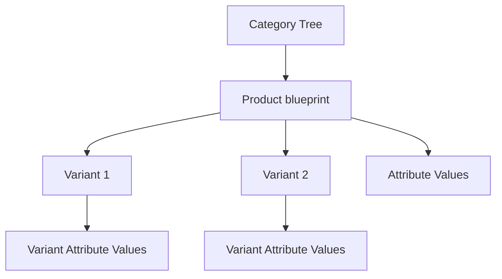

# Catalog API Guide (Frontend & AI)

This document outlines the Catalog (Product Management) protocol for the Marketplace platform. It covers category browsing, product discovery, and the management of product blueprints and variants.

---

## 1. Core Concepts

The catalog follows a hierarchical and flexible structure:

- **Categories**: Organized as a recursive tree. Each category can define specific attributes that products within it must or can have.
- **Products**: The "blueprint" for an item. Contains base descriptions, the primary category, and product-level attributes.
- **Variants**: The actual "purchasable" units (SKUs). Each product can have multiple variants (e.g., Size: Small, Color: Red).
- **Attributes**: A dynamic system allowing products to have custom data (e.g., "CPU Speed", "Fabric Material") without changing the DB schema.

---

## 2. Catalog Architecture



---

## 3. Category API

### 3.1. List Categories (Flat)

Retrieves a flat list of categories, typically for admin tables or simple selection.

- **URL**: `GET /catalog/categories/`
- **Authentication**: None Required.
- **Query Params**:
  | Param | Type | Description |
  | :--- | :--- | :--- |
  | `name` | String | Case-insensitive search. |
  | `is_root` | Boolean| Filter for top-level categories only. |
- **Response (200 OK)**:
  ```json
  {
  	"categories": [
  		{
  			"category_id": "uuid",
  			"name": "Electronics",
  			"slug": "electronics",
  			"description": "Gadgets and more",
  			"image": "url/null",
  			"parent_id": "uuid/null",
  			"depth": 0,
  			"subcategory_count": 5
  		}
  	]
  }
  ```

### 3.2. Category Tree

Retrieves the full hierarchical structure, optimized for navigation menus.

- **URL**: `GET /catalog/categories/tree/` (Note: Implemented as a viewset action)
- **Response (200 OK)**: Nested `children` arrays, wrapped in `{"categories": [...]}`.

### 3.3. Category Attributes

Retrieves the attributes that should be collected when creating a product in this category.

- **URL**: `GET /catalog/categories/{category_id}/attributes/`
- **Response (200 OK)**:
  ```json
  {
  	"attributes": [
  		{
  			"attribute": {
  				"attribute_id": "uuid",
  				"name": "Screen Size",
  				"slug": "screen-size",
  				"input_type": "number",
  				"unit": "inches",
  				"options": []
  			},
  			"order": 1
  		}
  	]
  }
  ```

---

## 4. Product Discovery API (Public)

### 4.1. List Products

Public listing of published products. Includes active variants by default.

- **URL**: `GET /catalog/products/`
- **Query Params**:
  | Param | Type | Description |
  | :--- | :--- | :--- |
  | `category` | UUID | Filter by category. |
  | `min_price` | Decimal| Filter by base price. |
  | `max_price` | Decimal| Filter by base price. |
  | `name` | String | Title search (icontains). |
- **Response (200 OK)**:
  ```json
  {
    "products": [
      {
        "product_id": "uuid",
        "name": "Smartphone X",
        "slug": "smartphone-x",
        "base_price": "999.00",
        "is_published": true,
        "category_name": "Electronics",
        "images": [...],
        "user": { "user_id": "...", "email": "...", "full_name": "..." },
        "variants": [
          {
            "variant_id": "uuid",
            "name": "128GB - Black",
            "price": "999.00",
            "in_stock": true
          }
        ]
      }
    ]
  }
  ```

### 3.2. Product Detail

Retrieves full details of a single product using its slug.

- **URL**: `GET /catalog/products/{slug}/`
- **Response (200 OK)**: Wrapped in `{"product": {...}}`. Extensive data including all `attributes`, `images`, `variants`, and the owner `user`.

---

## 5. Product Management API (Staff/Owners)

Authenticated endpoints for creating and managing your own products.

### 5.1. Create Product

Creates a product "blueprint".

- **URL**: `POST /catalog/products/manage/`
- **Body**:
  ```json
  {
  	"name": "Smartphone X",
  	"description": "Latest flagship",
  	"base_price": "999.00",
  	"category": "uuid",
  	"attributes": {
  		"screen-size": 6.7,
  		"brand": "TechCo"
  	}
  }
  ```

### 5.2. Archive/Publish

Products are archived instead of hard-deleted to preserve order history.

- **Archive**: `POST /catalog/products/manage/{id}/archive/`
- **Publish**: `POST /catalog/products/manage/{id}/publish/`

---

## 6. Variant & Stock Management

Variants represent the actual physical items.

### 6.1. Adjust Stock

Atomically increase or decrease stock.

- **URL**: `POST /catalog/variants/manage/{id}/adjust-stock/`
- **Body**: `{ "quantity_delta": 5 }` (Use negative for reductions)
- **Response**: Updated `{"variant": {...}}` object.

---

## 7. Detailed Data Models

### 7.1. Product blueprint

| Field        | Type         | Description              |
| :----------- | :----------- | :----------------------- |
| `product_id` | UUID         | Unique identifier.       |
| `name`       | String       | Product title.           |
| `slug`       | String       | URL-friendly identifier. |
| `user`       | EmbeddedUser | Owner information.       |
| `created_at` | DateTime     | Creation timestamp.      |
| `updated_at` | DateTime     | Last update timestamp.   |

### 7.2. Attribute Values

Attributes are returned as a unified list regardless of their internal storage (text, number, etc).

| Field          | Type   | Description                                                 |
| :------------- | :----- | :---------------------------------------------------------- |
| `attribute_id` | UUID   | ID of the definition.                                       |
| `name`         | String | Display name.                                               |
| `slug`         | String | Internal ID for frontend logic.                             |
| `value`        | Mixed  | Can be String, Number, Boolean, or Array (for multiselect). |

---

## 8. Error Codes (Catalog Specific)

| Status | Code                 | Meaning                                             |
| :----- | :------------------- | :-------------------------------------------------- |
| 400    | `insufficient_stock` | Attempted to reduce stock below zero.               |
| 400    | `duplicate_sku`      | SKU is already in use by another variant.           |
| 400    | `invalid_attribute`  | Attribute provided does not belong to the category. |
| 403    | `not_owner`          | Attempted to edit a product owned by another user.  |
| 404    | `category_not_found` | Provided category ID is invalid.                    |
